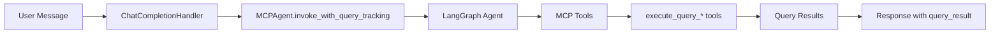
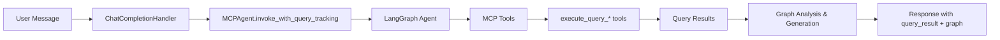

# Graph Visualization Backend Architecture

## Executive Summary

This document outlines the architecture for adding automatic graph visualization to the chat completion system. The feature intelligently detects when query results can be visualized as charts and generates appropriate graph data directly within the existing `invoke_with_query_tracking` method using a lean, function-based approach.

## Overview of the Feature

The graph visualization feature extends the existing query result tracking mechanism to automatically generate chart data when database queries return structured data suitable for visualization. This enhancement maintains the current API contract while adding an optional `graph` field to responses.

### Key Capabilities
- **Automatic Detection**: Analyzes query results to determine visualization potential
- **Multi-Chart Support**: Generates bar, line, pie, scatter, heatmap, and area charts
- **Intelligent Chart Selection**: Uses LLM analysis to choose optimal chart type
- **Seamless Integration**: Works within existing chat completion flow
- **Production Ready**: Includes comprehensive logging, validation, and error handling

## Integration Flow with Existing Chat Completion Endpoint

### Current Architecture Overview


### Enhanced Architecture with Graph Visualization


### Integration Points
1. **MCPAgent.invoke_with_query_tracking** - Enhanced to detect and generate graphs
2. **ChatCompletionHandler.process_chat_completion** - Passes through graph data
3. **Choice model** - Extended with optional `graph` field
4. **Response format** - Maintains backward compatibility

## Detailed Algorithm for Graph Generation After execute_query Tool

### Core Algorithm Flow

```python
async def analyze_and_generate_graph(query_result: Dict[str, Any]) -> Optional[Dict[str, Any]]:
    """
    Analyze query result and generate graph data if visualization is beneficial.
    
    Args:
        query_result: Raw query result from execute_query_* tool
        
    Returns:
        Graph data dict or None if not suitable for visualization
    """
    
    # Step 1: Extract and validate data
    rows = query_result.get("rows", [])
    columns = query_result.get("columns", [])
    
    if not _is_suitable_for_visualization(rows, columns):
        return None
    
    # Step 2: Analyze data characteristics
    data_analysis = _analyze_data_characteristics(rows, columns)
    
    # Step 3: Generate LLM prompt for chart type selection with data samples
    sample_rows = rows[:5] if len(rows) >= 5 else rows
    chart_prompt = _build_chart_analysis_prompt(data_analysis, query_result.get("query", ""), sample_rows)
    
    # Step 4: Get LLM recommendation
    chart_recommendation = await _get_chart_recommendation(chart_prompt)
    
    # Step 5: Transform data to chart format
    graph_data = _transform_to_chart_data(
        rows, columns, 
        chart_recommendation["chart_type"], 
        chart_recommendation["config"]
    )
    
    # Step 6: Validate and return
    if _validate_graph_data(graph_data):
        return graph_data
    
    return None
```

### Step 1: Data Suitability Check

```python
def _is_suitable_for_visualization(rows: List[Dict], columns: List[str]) -> bool:
    """
    Check if query result is suitable for visualization.
    
    Criteria:
    - Must have at least 2 rows of data
    - Must have at least 2 columns
    - At least one column must be numeric or temporal
    - Row count should be reasonable (2-1000 rows)
    """
    
    if not rows or len(rows) < 2:
        logger.debug("Insufficient data rows for visualization")
        return False
    
    if not columns or len(columns) < 2:
        logger.debug("Insufficient columns for visualization")
        return False
    
    if len(rows) > 1000:
        logger.debug("Too many rows for effective visualization")
        return False
    
    # Check for at least one numeric or date column
    has_numeric_or_date = False
    for row in rows[:3]:  # Check first 3 rows
        for col in columns:
            value = row.get(col)
            if _is_numeric(value) or _is_date_like(value):
                has_numeric_or_date = True
                break
        if has_numeric_or_date:
            break
    
    if not has_numeric_or_date:
        logger.debug("No numeric or date columns found")
        return False
    
    logger.info(f"Data suitable for visualization: {len(rows)} rows, {len(columns)} columns")
    return True
```

### Step 2: Data Characteristics Analysis

```python
def _analyze_data_characteristics(rows: List[Dict], columns: List[str]) -> Dict[str, Any]:
    """
    Analyze the characteristics of the data to inform chart selection.
    
    Returns:
        Dict containing:
        - numeric_columns: List of numeric column names
        - categorical_columns: List of categorical column names  
        - date_columns: List of date/time column names
        - row_count: Number of data rows
        - value_ranges: Min/max for numeric columns
        - unique_counts: Count of unique values per column
    """
    
    analysis = {
        "numeric_columns": [],
        "categorical_columns": [],
        "date_columns": [],
        "row_count": len(rows),
        "value_ranges": {},
        "unique_counts": {}
    }
    
    for col in columns:
        values = [row.get(col) for row in rows if row.get(col) is not None]
        if not values:
            continue
            
        analysis["unique_counts"][col] = len(set(str(v) for v in values))
        
        # Classify column type
        if all(_is_numeric(v) for v in values):
            analysis["numeric_columns"].append(col)
            numeric_vals = [float(v) for v in values]
            analysis["value_ranges"][col] = {
                "min": min(numeric_vals),
                "max": max(numeric_vals),
                "mean": sum(numeric_vals) / len(numeric_vals)
            }
        elif any(_is_date_like(v) for v in values):
            analysis["date_columns"].append(col)
        else:
            analysis["categorical_columns"].append(col)
    
    logger.debug(f"Data analysis: {analysis}")
    return analysis
```

### Step 3: LLM Chart Recommendation System

```python
def _build_chart_analysis_prompt(data_analysis: Dict, original_query: str, sample_rows: List[Dict]) -> str:
    """
    Build prompt for LLM to analyze data and recommend chart type.
    Includes actual data samples for better analysis.
    """
    
    # Format sample data for display
    sample_data_str = "\n".join([
        json.dumps(row, indent=2) for row in sample_rows[:5]
    ])
    
    prompt = f"""
Analyze this database query result to recommend the best chart visualization:

ORIGINAL QUERY: {original_query}

DATA CHARACTERISTICS:
- Total rows: {data_analysis['row_count']}
- Numeric columns: {data_analysis['numeric_columns']}
- Categorical columns: {data_analysis['categorical_columns']} 
- Date columns: {data_analysis['date_columns']}
- Unique value counts: {data_analysis['unique_counts']}

VALUE RANGES:
{json.dumps(data_analysis.get('value_ranges', {}), indent=2)}

SAMPLE DATA (first 5 rows):
{sample_data_str}

TASK: Recommend the single best chart type and configuration based on the actual data structure and values shown above.

AVAILABLE CHART TYPES:
- bar: Compare categorical data values
- line: Show trends over time or ordered categories
- pie: Show parts of a whole (max 8 categories)
- scatter: Show relationship between two numeric variables
- area: Show cumulative values or trends with filled area
- heatmap: Show correlation or intensity across two dimensions

RESPONSE FORMAT (JSON only):
{{
  "chart_type": "bar|line|pie|scatter|area|heatmap",
  "reasoning": "Why this chart type is optimal for this data",
  "config": {{
    "x_axis": "column_name",
    "y_axis": "column_name", 
    "title": "Descriptive chart title",
    "color_field": "column_name_or_null"
  }}
}}

Requirements:
- Choose the most informative visualization for the data
- Ensure x_axis and y_axis reference actual column names from the sample data
- Create a descriptive title related to the original query
- For pie charts, use categorical column with <8 unique values
- For time series, prefer line or area charts
- Consider the business context from the original query and actual data values
"""
    return prompt.strip()
```

### Step 4: LLM Integration

```python
async def _get_chart_recommendation(prompt: str) -> Dict[str, Any]:
    """
    Get chart recommendation from LLM.
    
    Uses the same Gemini LLM instance as the main agent.
    """
    
    try:
        # Use agent's LLM instance for consistency
        if hasattr(self, 'llm') and self.llm:
            llm_response = await self.llm.ainvoke([HumanMessage(content=prompt)])
            response_text = llm_response.content
        else:
            raise Exception("LLM not available for chart analysis")
        
        # Extract JSON from response
        json_match = re.search(r'\{.*\}', response_text, re.DOTALL)
        if not json_match:
            raise ValueError("No JSON found in LLM response")
        
        recommendation = json.loads(json_match.group())
        
        # Validate recommendation structure
        required_fields = ["chart_type", "reasoning", "config"]
        if not all(field in recommendation for field in required_fields):
            raise ValueError("Incomplete recommendation from LLM")
        
        config = recommendation["config"]
        if not all(field in config for field in ["x_axis", "y_axis", "title"]):
            raise ValueError("Incomplete config in recommendation")
        
        logger.info(f"LLM recommended {recommendation['chart_type']} chart: {recommendation['reasoning']}")
        return recommendation
        
    except Exception as e:
        logger.error(f"Failed to get chart recommendation: {e}")
        # Fallback to simple heuristic
        return _get_fallback_recommendation(data_analysis)
```

## Data Transformation Logic for Each Chart Type

### Core Transformation Function

```python
def _transform_to_chart_data(
    rows: List[Dict], 
    columns: List[str], 
    chart_type: str, 
    config: Dict[str, Any]
) -> Dict[str, Any]:
    """
    Transform raw query data into Recharts-compatible format.
    """
    
    transformers = {
        "bar": _transform_bar_chart,
        "line": _transform_line_chart, 
        "pie": _transform_pie_chart,
        "scatter": _transform_scatter_chart,
        "area": _transform_area_chart,
        "heatmap": _transform_heatmap_chart
    }
    
    transformer = transformers.get(chart_type)
    if not transformer:
        raise ValueError(f"Unsupported chart type: {chart_type}")
    
    try:
        chart_data = transformer(rows, columns, config)
        
        # Add metadata
        chart_data.update({
            "chart_type": chart_type,
            "data_source": "database_query",
            "generated_at": int(time.time()),
            "total_records": len(rows)
        })
        
        return chart_data
        
    except Exception as e:
        logger.error(f"Failed to transform data for {chart_type}: {e}")
        raise
```

### Bar Chart Transformation

```python
def _transform_bar_chart(rows: List[Dict], columns: List[str], config: Dict) -> Dict[str, Any]:
    """
    Transform data for Recharts BarChart component.
    
    Expected Recharts format:
    {
        "data": [
            {"name": "Category A", "value": 100, "color": "#8884d8"},
            {"name": "Category B", "value": 200, "color": "#82ca9d"}
        ],
        "x_key": "name",
        "y_key": "value", 
        "title": "Chart Title"
    }
    """
    
    x_col = config["x_axis"]
    y_col = config["y_axis"]
    
    if x_col not in columns or y_col not in columns:
        raise ValueError(f"Columns {x_col}/{y_col} not found in data")
    
    # Transform rows to chart data
    chart_data = []
    colors = ["#8884d8", "#82ca9d", "#ffc658", "#ff7300", "#00ff88", "#ff0088", "#8800ff", "#ffaa00"]
    
    for i, row in enumerate(rows[:20]):  # Limit to 20 bars for readability
        x_val = row.get(x_col, "Unknown")
        y_val = row.get(y_col, 0)
        
        # Convert y value to numeric
        try:
            y_numeric = float(y_val) if y_val is not None else 0
        except (ValueError, TypeError):
            y_numeric = 0
        
        chart_data.append({
            "name": str(x_val),
            "value": y_numeric,
            "color": colors[i % len(colors)]
        })
    
    return {
        "data": chart_data,
        "x_key": "name",
        "y_key": "value",
        "title": config.get("title", "Bar Chart"),
        "x_label": x_col,
        "y_label": y_col
    }
```

### Line Chart Transformation

```python
def _transform_line_chart(rows: List[Dict], columns: List[str], config: Dict) -> Dict[str, Any]:
    """
    Transform data for Recharts LineChart component.
    
    Expected format:
    {
        "data": [
            {"x": "2023-01", "y": 100},
            {"x": "2023-02", "y": 150}
        ],
        "x_key": "x",
        "y_key": "y",
        "title": "Line Chart"
    }
    """
    
    x_col = config["x_axis"]
    y_col = config["y_axis"]
    
    # Sort by x column if it's date-like
    sorted_rows = rows
    if any(_is_date_like(row.get(x_col)) for row in rows[:3]):
        try:
            sorted_rows = sorted(rows, key=lambda r: _parse_date_value(r.get(x_col, "")))
        except:
            pass  # Keep original order if sorting fails
    
    chart_data = []
    for row in sorted_rows[:100]:  # Limit for performance
        x_val = row.get(x_col)
        y_val = row.get(y_col)
        
        # Convert to appropriate format
        try:
            y_numeric = float(y_val) if y_val is not None else 0
        except (ValueError, TypeError):
            y_numeric = 0
            
        chart_data.append({
            "x": str(x_val) if x_val is not None else "Unknown",
            "y": y_numeric
        })
    
    return {
        "data": chart_data,
        "x_key": "x", 
        "y_key": "y",
        "title": config.get("title", "Line Chart"),
        "x_label": x_col,
        "y_label": y_col,
        "stroke": "#8884d8"
    }
```

### Pie Chart Transformation

```python
def _transform_pie_chart(rows: List[Dict], columns: List[str], config: Dict) -> Dict[str, Any]:
    """
    Transform data for Recharts PieChart component.
    
    Expected format:
    {
        "data": [
            {"name": "Category A", "value": 100, "fill": "#8884d8"},
            {"name": "Category B", "value": 200, "fill": "#82ca9d"}
        ],
        "name_key": "name",
        "value_key": "value"
    }
    """
    
    category_col = config["x_axis"]  # Category column
    value_col = config["y_axis"]     # Value column
    
    # Aggregate data by category
    category_totals = {}
    for row in rows:
        category = str(row.get(category_col, "Unknown"))
        value = row.get(value_col, 0)
        
        try:
            numeric_value = float(value) if value is not None else 0
        except (ValueError, TypeError):
            numeric_value = 1  # Count instead of sum for non-numeric
        
        category_totals[category] = category_totals.get(category, 0) + numeric_value
    
    # Limit to top 8 categories
    top_categories = sorted(category_totals.items(), key=lambda x: x[1], reverse=True)[:8]
    
    colors = ["#8884d8", "#82ca9d", "#ffc658", "#ff7300", "#00ff88", "#ff0088", "#8800ff", "#ffaa00"]
    
    chart_data = []
    for i, (category, value) in enumerate(top_categories):
        chart_data.append({
            "name": category,
            "value": value,
            "fill": colors[i % len(colors)]
        })
    
    return {
        "data": chart_data,
        "name_key": "name",
        "value_key": "value", 
        "title": config.get("title", "Pie Chart")
    }
```

### Scatter Chart Transformation

```python
def _transform_scatter_chart(rows: List[Dict], columns: List[str], config: Dict) -> Dict[str, Any]:
    """
    Transform data for Recharts ScatterChart component.
    """
    
    x_col = config["x_axis"]
    y_col = config["y_axis"]
    
    chart_data = []
    for row in rows[:200]:  # Limit points for performance
        x_val = row.get(x_col)
        y_val = row.get(y_col)
        
        try:
            x_numeric = float(x_val) if x_val is not None else 0
            y_numeric = float(y_val) if y_val is not None else 0
        except (ValueError, TypeError):
            continue  # Skip non-numeric points
        
        chart_data.append({
            "x": x_numeric,
            "y": y_numeric
        })
    
    return {
        "data": chart_data,
        "x_key": "x",
        "y_key": "y", 
        "title": config.get("title", "Scatter Chart"),
        "x_label": x_col,
        "y_label": y_col,
        "fill": "#8884d8"
    }
```

### Area Chart Transformation

```python
def _transform_area_chart(rows: List[Dict], columns: List[str], config: Dict) -> Dict[str, Any]:
    """
    Transform data for Recharts AreaChart component.
    Similar to line chart but with fill area.
    """
    
    # Use line chart transformation as base
    line_data = _transform_line_chart(rows, columns, config)
    
    # Add area-specific properties
    line_data.update({
        "fill": "#8884d8",
        "fillOpacity": 0.3,
        "stroke": "#8884d8"
    })
    
    return line_data
```

### Heatmap Chart Transformation

```python
def _transform_heatmap_chart(rows: List[Dict], columns: List[str], config: Dict) -> Dict[str, Any]:
    """
    Transform data for a custom heatmap visualization.
    
    Expected format for heatmap:
    {
        "data": [
            {"x": "Category1", "y": "Group1", "value": 10},
            {"x": "Category2", "y": "Group1", "value": 15}
        ],
        "x_key": "x",
        "y_key": "y", 
        "value_key": "value"
    }
    """
    
    x_col = config["x_axis"]
    y_col = config["y_axis"]
    
    # Find a numeric column for values
    value_col = None
    for col in columns:
        if col not in [x_col, y_col]:
            sample_values = [row.get(col) for row in rows[:3]]
            if all(_is_numeric(v) for v in sample_values if v is not None):
                value_col = col
                break
    
    if not value_col:
        raise ValueError("No numeric column found for heatmap values")
    
    chart_data = []
    for row in rows[:100]:  # Limit for performance
        x_val = str(row.get(x_col, "Unknown"))
        y_val = str(row.get(y_col, "Unknown"))
        value = row.get(value_col, 0)
        
        try:
            numeric_value = float(value) if value is not None else 0
        except (ValueError, TypeError):
            numeric_value = 0
        
        chart_data.append({
            "x": x_val,
            "y": y_val,
            "value": numeric_value
        })
    
    return {
        "data": chart_data,
        "x_key": "x",
        "y_key": "y",
        "value_key": "value",
        "title": config.get("title", "Heatmap"),
        "x_label": x_col,
        "y_label": y_col,
        "value_label": value_col
    }
```

## LLM Prompt Structure and Expected Response

### Prompt Template

The LLM analysis prompt is designed to be concise yet comprehensive, providing the model with enough context to make intelligent chart recommendations:

```python
CHART_ANALYSIS_PROMPT_TEMPLATE = """
Analyze this database query result to recommend the best chart visualization:

ORIGINAL QUERY: {original_query}

DATA CHARACTERISTICS:
- Total rows: {row_count}
- Numeric columns: {numeric_columns}
- Categorical columns: {categorical_columns}
- Date columns: {date_columns}
- Unique value counts: {unique_counts}

VALUE RANGES: {value_ranges}

SAMPLE DATA (first 5 rows):
{sample_data}

TASK: Recommend the single best chart type and configuration based on the actual data structure and values shown above.

AVAILABLE CHART TYPES:
- bar: Compare categorical data values
- line: Show trends over time or ordered categories  
- pie: Show parts of a whole (max 8 categories)
- scatter: Show relationship between two numeric variables
- area: Show cumulative values or trends with filled area
- heatmap: Show correlation or intensity across two dimensions

RESPONSE FORMAT (JSON only):
{{
  "chart_type": "bar|line|pie|scatter|area|heatmap",
  "reasoning": "Why this chart type is optimal for this data",
  "config": {{
    "x_axis": "column_name",
    "y_axis": "column_name",
    "title": "Descriptive chart title", 
    "color_field": "column_name_or_null"
  }}
}}

Requirements:
- Choose the most informative visualization for the data
- Ensure x_axis and y_axis reference actual column names from the sample data
- Create a descriptive title related to the original query
- For pie charts, use categorical column with <8 unique values
- For time series, prefer line or area charts
- Consider the business context from the original query and actual data values
"""
```

### Expected LLM Response Format

```json
{
  "chart_type": "bar",
  "reasoning": "Bar chart is optimal because the data compares categorical values (customer segments) against a numeric metric (total sales). The 5 unique categories are perfect for bar visualization, allowing easy comparison of sales performance across segments.",
  "config": {
    "x_axis": "customer_segment", 
    "y_axis": "total_sales",
    "title": "Total Sales by Customer Segment",
    "color_field": null
  }
}
```

### Response Processing Logic

```python
def _process_llm_response(llm_response: str) -> Dict[str, Any]:
    """
    Extract and validate chart recommendation from LLM response.
    """
    
    try:
        # Extract JSON from response (handles markdown code blocks)
        json_pattern = r'```(?:json)?\s*(\{.*?\})\s*```|(\{.*?\})'
        match = re.search(json_pattern, llm_response, re.DOTALL | re.IGNORECASE)
        
        if match:
            json_str = match.group(1) or match.group(2)
        else:
            # Try to find any JSON-like structure
            json_str = re.search(r'\{.*\}', llm_response, re.DOTALL).group()
        
        recommendation = json.loads(json_str)
        
        # Validate required fields
        _validate_recommendation(recommendation)
        
        return recommendation
        
    except Exception as e:
        logger.error(f"Failed to process LLM response: {e}")
        logger.debug(f"LLM response was: {llm_response}")
        raise ValueError(f"Invalid LLM response format: {e}")


def _validate_recommendation(recommendation: Dict[str, Any]) -> None:
    """Validate LLM recommendation structure."""
    
    required_fields = ["chart_type", "reasoning", "config"]
    for field in required_fields:
        if field not in recommendation:
            raise ValueError(f"Missing required field: {field}")
    
    valid_chart_types = ["bar", "line", "pie", "scatter", "area", "heatmap"]
    if recommendation["chart_type"] not in valid_chart_types:
        raise ValueError(f"Invalid chart type: {recommendation['chart_type']}")
    
    config = recommendation["config"]
    required_config = ["x_axis", "y_axis", "title"]
    for field in required_config:
        if field not in config:
            raise ValueError(f"Missing config field: {field}")
```

## Validation Logic

### Graph Data Validation

```python
def _validate_graph_data(graph_data: Dict[str, Any]) -> bool:
    """
    Validate generated graph data structure.
    
    Ensures the graph data is properly formatted for frontend consumption.
    """
    
    try:
        # Check required fields
        required_fields = ["data", "chart_type", "title"]
        for field in required_fields:
            if field not in graph_data:
                logger.error(f"Missing required graph field: {field}")
                return False
        
        # Validate data array
        data = graph_data["data"]
        if not isinstance(data, list) or len(data) == 0:
            logger.error("Graph data must be a non-empty list")
            return False
        
        # Check data structure based on chart type
        chart_type = graph_data["chart_type"]
        return _validate_chart_specific_data(data, chart_type)
        
    except Exception as e:
        logger.error(f"Graph data validation error: {e}")
        return False


def _validate_chart_specific_data(data: List[Dict], chart_type: str) -> bool:
    """Validate data structure for specific chart types."""
    
    validators = {
        "bar": _validate_bar_data,
        "line": _validate_line_data,
        "pie": _validate_pie_data,
        "scatter": _validate_scatter_data,
        "area": _validate_area_data,
        "heatmap": _validate_heatmap_data
    }
    
    validator = validators.get(chart_type)
    if not validator:
        logger.error(f"No validator for chart type: {chart_type}")
        return False
    
    return validator(data)


def _validate_bar_data(data: List[Dict]) -> bool:
    """Validate bar chart data format."""
    
    required_keys = {"name", "value"}
    for item in data:
        if not isinstance(item, dict):
            return False
        if not required_keys.issubset(item.keys()):
            return False
        if not isinstance(item.get("value"), (int, float)):
            return False
    
    return True


def _validate_pie_data(data: List[Dict]) -> bool:
    """Validate pie chart data format."""
    
    if len(data) > 8:
        logger.warning(f"Pie chart has {len(data)} slices, may be too many for readability")
    
    required_keys = {"name", "value"}
    total_value = 0
    
    for item in data:
        if not isinstance(item, dict):
            return False
        if not required_keys.issubset(item.keys()):
            return False
        
        value = item.get("value")
        if not isinstance(value, (int, float)) or value < 0:
            return False
        
        total_value += value
    
    if total_value <= 0:
        logger.error("Pie chart total value must be positive")
        return False
    
    return True


# Similar validators for other chart types...
```

## Extensive Logging Strategy

### Logging Levels and Categories

```python
class GraphVisualizationLogger:
    """Specialized logger for graph visualization operations."""
    
    def __init__(self):
        self.logger = logging.getLogger("moba_agent.graph_viz")
        
    def log_analysis_start(self, query_result: Dict) -> None:
        """Log start of graph analysis."""
        rows_count = len(query_result.get("rows", []))
        columns_count = len(query_result.get("columns", []))
        
        self.logger.info(
            f"Starting graph analysis for query result: "
            f"{rows_count} rows, {columns_count} columns"
        )
        
    def log_suitability_check(self, suitable: bool, reason: str = None) -> None:
        """Log data suitability determination."""
        if suitable:
            self.logger.info("Data determined suitable for visualization")
        else:
            self.logger.info(f"Data not suitable for visualization: {reason}")
            
    def log_data_analysis(self, analysis: Dict) -> None:
        """Log detailed data characteristics."""
        self.logger.debug(f"Data analysis complete: {json.dumps(analysis, indent=2)}")
        
        # Log key insights
        self.logger.info(
            f"Data characteristics: "
            f"{len(analysis['numeric_columns'])} numeric, "
            f"{len(analysis['categorical_columns'])} categorical, "
            f"{len(analysis['date_columns'])} date columns"
        )
        
    def log_llm_prompt(self, prompt: str) -> None:
        """Log LLM analysis prompt (truncated)."""
        truncated = prompt[:200] + "..." if len(prompt) > 200 else prompt
        self.logger.debug(f"LLM analysis prompt: {truncated}")
        
    def log_llm_response(self, response: str, recommendation: Dict) -> None:
        """Log LLM recommendation."""
        self.logger.info(
            f"LLM recommended {recommendation['chart_type']} chart: "
            f"{recommendation['reasoning'][:100]}..."
        )
        self.logger.debug(f"Full LLM response: {response}")
        
    def log_transformation_start(self, chart_type: str, config: Dict) -> None:
        """Log start of data transformation."""
        self.logger.info(f"Transforming data for {chart_type} chart")
        self.logger.debug(f"Transformation config: {config}")
        
    def log_transformation_complete(self, chart_data: Dict) -> None:
        """Log successful data transformation."""
        data_points = len(chart_data.get("data", []))
        self.logger.info(f"Data transformation complete: {data_points} data points")
        
    def log_validation_result(self, valid: bool, chart_type: str) -> None:
        """Log validation results."""
        if valid:
            self.logger.info(f"Generated {chart_type} chart data passed validation")
        else:
            self.logger.error(f"Generated {chart_type} chart data failed validation")
            
    def log_error(self, operation: str, error: Exception) -> None:
        """Log errors with context."""
        self.logger.error(f"Graph visualization error in {operation}: {str(error)}", exc_info=True)
        
    def log_fallback(self, reason: str) -> None:
        """Log fallback to default behavior."""
        self.logger.warning(f"Using fallback chart recommendation: {reason}")
```

### Performance Logging

```python
def log_performance_metrics(func):
    """Decorator to log performance metrics for graph operations."""
    
    @wraps(func)
    async def wrapper(*args, **kwargs):
        start_time = time.time()
        operation_name = func.__name__
        
        logger.debug(f"Starting {operation_name}")
        
        try:
            result = await func(*args, **kwargs)
            
            duration = time.time() - start_time
            logger.info(f"{operation_name} completed in {duration:.3f}s")
            
            # Log additional metrics
            if isinstance(result, dict) and "data" in result:
                data_points = len(result["data"])
                logger.debug(f"{operation_name} processed {data_points} data points")
            
            return result
            
        except Exception as e:
            duration = time.time() - start_time
            logger.error(f"{operation_name} failed after {duration:.3f}s: {str(e)}")
            raise
    
    return wrapper
```

## Code Examples Using Lean Architecture Approach

### Integration in MCPAgent.invoke_with_query_tracking

```python
# In src/moba_agent/agent.py

async def invoke_with_query_tracking(self, message: str, thread_id: str = "default") -> Dict[str, Any]:
    """
    Enhanced version with graph visualization capability.
    """
    # ... existing code for getting agent response ...
    
    # Initialize result dict
    result = {
        "response": "",
        "query_result": None,
        "graph": None  # New field for graph data
    }
    
    # ... existing code for processing messages and extracting query_result ...
    
    # NEW: Generate graph if query result is available
    if query_result:
        try:
            logger.info("Analyzing query result for graph visualization potential")
            graph_data = await analyze_and_generate_graph(query_result)
            
            if graph_data:
                result["graph"] = graph_data
                logger.info(f"Generated {graph_data['chart_type']} chart with {len(graph_data['data'])} data points")
            else:
                logger.info("Query result not suitable for visualization")
                
        except Exception as e:
            logger.error(f"Graph generation failed: {e}", exc_info=True)
            # Continue without graph - don't fail the entire request
    
    return result

# NEW: Graph analysis functions (added to agent.py)

async def analyze_and_generate_graph(self, query_result: Dict[str, Any]) -> Optional[Dict[str, Any]]:
    """Generate graph data from query result."""
    
    logger.info("Starting graph analysis for query result")
    
    try:
        # Step 1: Extract and validate data
        rows = query_result.get("rows", [])
        columns = query_result.get("columns", [])
        
        if not is_suitable_for_visualization(rows, columns):
            logger.info("Data not suitable for visualization")
            return None
        
        # Step 2: Analyze data characteristics
        data_analysis = analyze_data_characteristics(rows, columns)
        logger.debug(f"Data analysis: {data_analysis}")
        
        # Step 3: Get chart recommendation from LLM
        sample_rows = rows[:5] if len(rows) >= 5 else rows
        chart_recommendation = await get_chart_recommendation(
            data_analysis, 
            query_result.get("query", ""),
            sample_rows,
            self.llm  # Pass LLM instance
        )
        
        # Step 4: Transform data
        graph_data = transform_to_chart_data(
            rows, 
            columns, 
            chart_recommendation["chart_type"],
            chart_recommendation["config"]
        )
        
        # Step 5: Validate
        if validate_graph_data(graph_data):
            logger.info(f"Successfully generated {chart_recommendation['chart_type']} chart")
            return graph_data
        else:
            logger.error("Generated graph data failed validation")
            return None
            
    except Exception as e:
        logger.error(f"Graph generation failed: {e}", exc_info=True)
        return None


# Utility functions (added to agent.py)

def is_suitable_for_visualization(rows: List[Dict], columns: List[str]) -> bool:
    """Check if data is suitable for visualization."""
    # Implementation as detailed above...
    pass

def analyze_data_characteristics(rows: List[Dict], columns: List[str]) -> Dict[str, Any]:
    """Analyze data to determine optimal chart type."""
    # Implementation as detailed above...
    pass

async def get_chart_recommendation(data_analysis: Dict, original_query: str, sample_rows: List[Dict], llm) -> Dict[str, Any]:
    """Get chart recommendation from LLM with actual data samples."""
    # Implementation as detailed above...
    pass

def transform_to_chart_data(rows: List[Dict], columns: List[str], chart_type: str, config: Dict) -> Dict[str, Any]:
    """Transform data to chart format."""
    # Implementation as detailed above...
    pass

def validate_graph_data(graph_data: Dict[str, Any]) -> bool:
    """Validate graph data structure."""
    # Implementation as detailed above...
    pass
```

### Enhanced Chat Handler Integration

```python
# In src/moba_server/chat_handler.py

async def process_chat_completion(
    self,
    request: ChatCompletionRequest,
    thread_id: Optional[str] = None
) -> ChatCompletionResponse:
    """Enhanced to pass through graph data."""
    
    try:
        # ... existing code for invoking agent ...
        
        # Call MCPAgent with query tracking
        agent_result = await self.agent.invoke_with_query_tracking(
            message=message_content,
            thread_id=thread_id
        )
        
        # Extract response, query result, AND graph data
        response_content = agent_result.get("response", "")
        raw_query_result = agent_result.get("query_result")
        graph_data = agent_result.get("graph")  # NEW: Extract graph data
        
        # ... existing query_result transformation code ...
        
        # Create response with graph data
        response = ChatCompletionResponse(
            id=f"chatcmpl-{uuid4()}",
            created=int(time.time()),
            model=model_name,
            choices=[Choice(
                index=0,
                message=ChatMessage(
                    role=MessageRole.ASSISTANT,
                    content=response_content
                ),
                finish_reason="stop",
                query_result=transformed_query_result,
                graph=graph_data  # NEW: Include graph data
            )]
        )
        
        if graph_data:
            logger.info(f"Response includes {graph_data['chart_type']} graph with {len(graph_data['data'])} data points")
        
        return response
        
    except Exception as e:
        logger.error(f"Error processing chat completion: {str(e)}")
        # ... error handling ...
```

### Enhanced Models

```python
# In src/moba_server/models.py

class Choice(BaseModel):
    """Enhanced Choice model with graph field."""
    index: int = Field(description="Index of this choice")
    message: ChatMessage = Field(description="The generated message") 
    finish_reason: Optional[str] = Field(
        default=None,
        description="Reason the generation finished"
    )
    query_result: Optional["MCPQueryResult"] = Field(
        default=None,
        description="Database query result if a query was executed"
    )
    graph: Optional[Dict[str, Any]] = Field(  # NEW FIELD
        default=None,
        description="Graph visualization data if generated from query result"
    )


class GraphData(BaseModel):
    """Optional model for graph data validation."""
    chart_type: str = Field(description="Type of chart (bar, line, pie, etc.)")
    data: List[Dict[str, Any]] = Field(description="Chart data points")
    title: str = Field(description="Chart title")
    x_key: Optional[str] = Field(default=None, description="X-axis data key")
    y_key: Optional[str] = Field(default=None, description="Y-axis data key") 
    x_label: Optional[str] = Field(default=None, description="X-axis label")
    y_label: Optional[str] = Field(default=None, description="Y-axis label")
    generated_at: int = Field(description="Unix timestamp when generated")
    total_records: int = Field(description="Total records processed")
```

## Production Considerations

### Error Handling Strategy

```python
def safe_graph_generation(func):
    """Decorator to safely handle graph generation errors."""
    
    @wraps(func)
    async def wrapper(*args, **kwargs):
        try:
            return await func(*args, **kwargs)
        except Exception as e:
            logger.error(f"Graph generation error: {e}", exc_info=True)
            # Always return None for graph failures
            # Don't let graph generation break the main chat flow
            return None
    
    return wrapper
```

### Performance Optimization

- **Data Limiting**: Automatic limits on data points (bar: 20, line: 100, pie: 8, etc.)
- **Async Processing**: All LLM calls are async to avoid blocking
- **Memory Management**: Process data in chunks for large result sets

### Configuration Options

```python
# In config.py
class Config:
    # Existing fields...
    
    # Graph visualization settings
    enable_graph_generation: bool = True
    max_graph_data_points: int = 200
    max_pie_chart_slices: int = 8
    graph_generation_timeout: int = 30
```

This architecture provides a comprehensive, production-ready solution for adding graph visualization to the existing chat completion system while maintaining the lean, function-based approach and preserving all existing functionality.