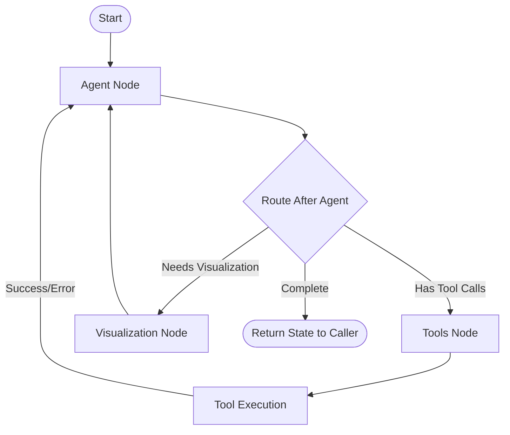

# Visualization Node Extension Architecture

## Executive Summary

This document outlines the architectural approach for extending the existing ReAct agent with a dedicated visualization node, replacing the current direct LLM invocation pattern. This approach leverages LangGraph's single-agent architecture with conditional routing to maintain simplicity while adding visualization capabilities.

**Decision:** Build a custom agent from scratch with a visualization node rather than wrapping or extending `create_react_agent`.

---

## Table of Contents

1. [Current State Analysis](#current-state-analysis)
2. [Architectural Decision](#architectural-decision)
3. [Implementation Design](#implementation-design)
4. [Migration Strategy](#migration-strategy)
5. [Technical Specifications](#technical-specifications)
6. [Benefits and Trade-offs](#benefits-and-trade-offs)
7. [Testing Strategy](#testing-strategy)
8. [Future Considerations](#future-considerations)

---

## Current State Analysis

### Existing Implementation

The current implementation has two separate invocation patterns:

1. **Line 696** (`src/moba_agent/agent.py`):
   ```python
   structured_response = await self.llm_structured.ainvoke(enhanced_messages)
   ```
   - Direct LLM call for visualization decisions
   - Uses structured output schema (`StructuredAgentResponse`)
   - No memory persistence for this decision

2. **Lines 751-754** (`src/moba_agent/agent.py`):
   ```python
   response = await self.agent.ainvoke(
       {"messages": messages},
       config=config
   )
   ```
   - ReAct agent with tools and checkpointer
   - Full conversation memory via `MemorySaver`
   - Handles tool execution and user interactions

### Problems with Current Approach

- **Memory Fragmentation**: Visualization decisions aren't persisted in conversation memory
- **Inconsistent Patterns**: Two different invocation methods for related functionality
- **Limited Context**: Visualization agent doesn't benefit from conversation history
- **Debugging Complexity**: Multiple code paths for similar operations

---

## Architectural Decision

### Chosen Approach: Custom Agent with Visualization Node

After comprehensive research comparing multi-agent vs single-agent architectures, we've decided to:

**Build a custom agent from scratch with a visualization node for full control over the flow**

### Rationale

1. **Domain Alignment**: Visualization is a single-domain task that naturally follows query execution
2. **Performance**: Avoids multi-agent overhead for sequential workflows
3. **Simplicity**: Single execution path with natural state flow
4. **Memory Coherence**: Automatic memory sharing through graph state
5. **Maintainability**: Fewer components to manage and debug

### Alternative Considered: Multi-Agent Approach

We evaluated creating a separate visualization agent but rejected it because:
- Unnecessary complexity for a deterministic, sequential task
- Additional overhead without corresponding benefits
- More complex memory coordination requirements
- Research shows 50% performance degradation for single-domain tasks

---

## Implementation Design

### Graph Architecture (FINAL CORRECTED VERSION)



**Critical Architecture Points:**

1. **Tool Error Handling Loop**
   - When tools fail (invalid arguments, API errors, etc.), they return `ToolMessage` with `status="error"`
   - Error messages flow back to Agent, which can observe and retry with corrected arguments
   - This creates a self-correcting loop: Agent → Tools → Error → Agent → Retry

2. **Visualization-Agent Loop** 
   - Visualization node generates structured data (chart config, etc.)
   - This flows BACK to Agent (not to End!)
   - Agent formats user-friendly response: "I've created a bar chart showing..."
   - User never sees raw `StructuredAgentResponse` objects

3. **END Node Behavior**
   - Only reached when Agent determines conversation is complete
   - Returns entire state to `invoke_with_query_tracking`
   - Caller extracts formatted messages and visualization config

### Core Components

#### 1. Extended State Definition

```python
from typing import TypedDict, Optional
from langchain_core.messages import BaseMessage

class ExtendedAgentState(MessagesState):
    """Extended state to include visualization decisions"""
    visualization_decision: Optional[StructuredAgentResponse]
    query_result: Optional[Dict[str, Any]]
    thread_id: str
```

#### 2. Visualization Node Implementation

```python
async def visualization_node(state: ExtendedAgentState) -> ExtendedAgentState:
    """
    Analyze conversation and query results for visualization needs.
    
    This node:
    1. Examines the conversation history
    2. Analyzes any query results
    3. Makes structured decisions about visualization
    4. Persists decisions in agent state
    """
    # Log memory access for debugging
    thread_id = state.get("thread_id", "default")
    self.logger.debug(f"[MEMORY_ACCESS] Agent: visualization_node, Thread: {thread_id}, Action: analyzing")
    
    # Prepare enhanced messages with system context
    messages = state["messages"]
    system_prompt = self._get_visualization_system_prompt()
    enhanced_messages = [SystemMessage(content=system_prompt)] + messages
    
    # Add query result context if available
    if state.get("query_result"):
        result_summary = self._format_query_result_summary(state["query_result"])
        enhanced_messages.append(SystemMessage(content=result_summary))
    
    try:
        # Invoke structured LLM for visualization decision
        structured_response = await self.llm_for_visualization.ainvoke(enhanced_messages)
        
        # Log decision
        self.logger.info(f"Visualization decision - Should visualize: {structured_response.should_visualize}")
        if structured_response.should_visualize and structured_response.chart_config:
            self.logger.info(f"Chart type selected: {structured_response.chart_config.chart_type}")
        
        # Store in state for downstream use
        state["visualization_decision"] = structured_response
        
        # Important: Do NOT add messages here - let the agent format the response
        # The agent will see this decision and create a user-friendly message
        
    except Exception as e:
        self.logger.error(f"Visualization node failed: {e}", exc_info=True)
        # Set default decision on error
        state["visualization_decision"] = StructuredAgentResponse(
            content="",
            should_visualize=False,
            chart_config=None,
            reasoning="Error in visualization analysis"
        )
    
    self.logger.debug(f"[MEMORY_COMPLETE] Agent: visualization_node, Thread: {thread_id}")
    return state
```

#### 3. Routing Logic (CORRECTED)

```python
def route_after_agent(state: ExtendedAgentState) -> str:
    """
    Determine next step after agent has processed tool results.
    
    CRITICAL: This is called AFTER the agent has observed tool results.
    The ReAct pattern ensures tools always route back to agent first.
    
    Routes to:
    - "tools": If agent needs to call more tools
    - "visualize": If query results exist and need visualization
    - "end": If conversation is complete
    """
    import re
    from .constants import QUERY_TOOL_PATTERN
    
    last_message = state["messages"][-1]
    
    # Check if agent wants to call more tools
    if isinstance(last_message, AIMessage):
        if hasattr(last_message, "tool_calls") and last_message.tool_calls:
            return "tools"
    
    # After agent has processed results, check if visualization needed
    query_tool_pattern = re.compile(QUERY_TOOL_PATTERN)
    
    # Look for query results in conversation history
    for message in reversed(state["messages"][-10:]):
        if isinstance(message, ToolMessage) and query_tool_pattern.match(message.name):
            try:
                result = json.loads(message.content)
                if result.get("rows") and len(result["rows"]) > 0:
                    # Agent has already seen and responded to these results
                    # Now we can add visualization
                    state["query_result"] = result
                    return "visualize"
            except (json.JSONDecodeError, TypeError):
                pass
    
    # No visualization needed, end the conversation
    return "end"

# IMPORTANT: Tools MUST route back to agent (not to visualization)
# The flow is: agent → tools → agent → visualization (if needed) → agent → end
```

#### 4. Custom Agent Implementation

Since `create_react_agent` returns a complete compiled graph, we'll build a custom agent from scratch to have full control over the visualization flow:

```python
async def _create_agent(self):
    """Create custom agent with visualization capabilities"""
    from langgraph.prebuilt import ToolNode
    from langgraph.graph import END
    import re
    
    workflow = StateGraph(ExtendedAgentState)
    
    # Create tool node using all available tools
    tool_node = ToolNode(self.all_tools)
    
    # Create agent node with proper prompt and visualization formatting
    async def agent_node(state: ExtendedAgentState):
        """Main agent reasoning node - handles tools, errors, and visualization formatting"""
        messages = state["messages"]
        
        # Check if we need to format visualization response
        if state.get("visualization_decision") and not state.get("visualization_formatted"):
            viz = state["visualization_decision"]
            if viz.should_visualize and viz.chart_config:
                # Format user-friendly message
                response = f"I've created a {viz.chart_config.chart_type} chart "
                if viz.chart_config.title:
                    response += f"titled '{viz.chart_config.title}' "
                response += "to visualize the data. "
                response += viz.content if viz.content else "The chart shows the query results clearly."
            else:
                response = viz.content or "Based on the data analysis, no visualization is needed."
            
            return {"messages": [AIMessage(content=response)]}
        
        # Add system prompt if not present
        if not messages or not isinstance(messages[0], SystemMessage):
            system_prompt = """You are a helpful assistant with the following capabilities:

1. **Data Visualization**: You can create interactive charts and graphs from query results. When users ask for visualizations:
   - Execute the appropriate database query using available tools
   - The system will automatically analyze the results and generate appropriate visualizations
   - Summarize the data insights along with the visualization
   - Suggest the most suitable chart types based on the data characteristics

2. **Database Queries**: You have access to execute_query_* tools to retrieve data from various databases. Use these tools to:
   - Fetch data for analysis
   - Answer questions about the data
   - Prepare datasets for visualization

3. **GitLab Integration**: You can create GitLab issues when requested. Use the create_gitlab_issue tool to:
   - Create new issues in GitLab projects
   - Set issue titles and descriptions
   - Add labels, assignees, and milestones
   - The user needs to provide a project URL
   
When creating GitLab issues:
- Ask for clarification if the issue details are unclear
- Confirm the project URL if not specified
- Provide the issue URL after successful creation
- Handle errors gracefully and suggest fixes

Always be proactive in suggesting the use of available tools when appropriate. When data is retrieved, consider if a visualization would help the user better understand the results."""
            messages = [SystemMessage(content=system_prompt)] + messages
        
        response = await self.llm.ainvoke(messages)
        return {"messages": [response]}
    
    # Add all nodes
    workflow.add_node("agent", agent_node)
    workflow.add_node("tools", tool_node)
    workflow.add_node("visualize", visualization_node)
    
    # Define routing logic
    def route_after_agent(state: ExtendedAgentState) -> str:
        """Route after agent - handles tools, visualization, and formatting"""
        from .constants import QUERY_TOOL_PATTERN
        
        last_message = state["messages"][-1]
        
        # If agent wants to call tools
        if isinstance(last_message, AIMessage):
            if hasattr(last_message, "tool_calls") and last_message.tool_calls:
                return "tools"
        
        # Check if we just came from visualization node
        if state.get("visualization_decision") and not state.get("visualization_formatted"):
            # Agent needs to format the visualization response
            # This happens in the agent node itself
            state["visualization_formatted"] = True
            return "end"  # Agent has formatted the response
        
        # Check if we need visualization (haven't done it yet)
        if not state.get("visualization_decision"):
            query_tool_pattern = re.compile(QUERY_TOOL_PATTERN)
            for msg in reversed(state["messages"][-10:]):
                if isinstance(msg, ToolMessage) and query_tool_pattern.match(msg.name):
                    # Skip error messages
                    if hasattr(msg, 'status') and msg.status == 'error':
                        continue
                    try:
                        result = json.loads(msg.content)
                        if result.get("rows") and len(result["rows"]) > 0:
                            state["query_result"] = result
                            return "visualize"
                    except (json.JSONDecodeError, TypeError):
                        pass
        
        return "end"  # Conversation complete
    
    # Set up edges
    workflow.set_entry_point("agent")
    
    # CRITICAL EDGES:
    # 1. Tools ALWAYS route back to agent (for error handling and observation)
    workflow.add_edge("tools", "agent")
    
    # 2. Visualization ALWAYS routes back to agent (for formatting user response)
    workflow.add_edge("visualize", "agent")
    
    # 3. Agent is the central hub - decides all routing
    workflow.add_conditional_edges(
        "agent", 
        route_after_agent,
        {
            "tools": "tools",        # Execute tools
            "visualize": "visualize", # Generate visualization config
            "end": END               # Complete conversation
        }
    )
    
    # Compile with checkpointer and recursion limit
    from .constants import AGENT_RECURSION_LIMIT
    
    self.agent = workflow.compile(
        checkpointer=self.checkpointer,
        interrupt_before=[],
        interrupt_after=[]
    ).with_config(
        recursion_limit=AGENT_RECURSION_LIMIT  # Prevent infinite loops
    )
    
    self.logger.info(f"Custom agent created with recursion limit: {AGENT_RECURSION_LIMIT}")
```

### Handling Retry Logic in Agent Node

To track consecutive errors and prevent infinite retries, enhance the agent node:

```python
async def agent_node(state: ExtendedAgentState):
    """Enhanced agent node with retry tracking"""
    from .constants import AGENT_MAX_CONSECUTIVE_TOOL_ERRORS
    
    # Track consecutive errors per tool
    if not hasattr(state, 'tool_error_counts'):
        state['tool_error_counts'] = {}
    
    # Check recent messages for tool errors
    last_messages = state["messages"][-2:]
    for msg in last_messages:
        if isinstance(msg, ToolMessage):
            if hasattr(msg, 'status') and msg.status == 'error':
                # Increment error count for this tool
                tool_name = msg.name
                state['tool_error_counts'][tool_name] = state['tool_error_counts'].get(tool_name, 0) + 1
                
                # Check if we've hit the limit
                if state['tool_error_counts'][tool_name] >= AGENT_MAX_CONSECUTIVE_TOOL_ERRORS:
                    # Stop retrying this tool
                    error_response = f"I've tried {tool_name} {AGENT_MAX_CONSECUTIVE_TOOL_ERRORS} times but it keeps failing. "
                    error_response += f"The last error was: {msg.content}. "
                    error_response += "Let me try a different approach or please check the query."
                    return {"messages": [AIMessage(content=error_response)]}
            else:
                # Success - reset error count for this tool
                if msg.name in state.get('tool_error_counts', {}):
                    state['tool_error_counts'][msg.name] = 0
    
    # Continue with normal agent logic...
```

---

## Correct Flow Explanation

### Complete Flow with Error Handling and Visualization Formatting

**Example Query:** "Show me top 10 products by revenue with a chart"

**Step-by-Step Flow Including Error Cases:**

1. **User → Agent (Initial)**
   - User message enters the graph
   - Agent receives: `[HumanMessage("Show me top 10 products...")]`
   - Agent decides to call `execute_query_sales` tool

2. **Agent → Tools**
   - Agent returns: `AIMessage` with `tool_calls=[{name: "execute_query_sales", args: {...}}]`
   - Graph routes to Tools node

3. **Tools Execution (Success Path)**
   - Tool executes successfully
   - Returns: `ToolMessage(name="execute_query_sales", content="{rows: [...], columns: [...]}")`
   - Routes back to Agent

   **OR Tools Execution (Error Path)**
   - Tool fails (e.g., wrong table name, invalid SQL)
   - Returns: `ToolMessage(name="execute_query_sales", content="Error: Table 'products' not found", status="error")`
   - Routes back to Agent

4. **Agent Observes Results or Error**
   - **Success**: Agent sees data, formulates: "I found the top 10 products. Product X has revenue of $Y..."
   - **Error**: Agent sees error, retries: "Let me correct that query..." → Back to step 2
   - This creates a self-correcting loop until success or max retries

5. **Agent → Visualization Check**
   - After successful query, `route_after_agent` checks for valid query results
   - Finds non-error `ToolMessage` with data
   - Routes to visualization node

6. **Visualization Node → Agent (CRITICAL)**
   - Generates: `StructuredAgentResponse` with chart config
   - Stores in state as `visualization_decision`
   - **Routes BACK to Agent** (not to End!)

7. **Agent Formats User Response**
   - Agent sees `visualization_decision` in state
   - Formats: "I've created a bar chart titled 'Top 10 Products by Revenue' to visualize the data..."
   - Adds formatted `AIMessage` to messages
   - Sets `visualization_formatted = True`

8. **End → Return to Caller**
   - Complete state with:
     - Agent's data insights
     - User-friendly visualization description
     - Raw visualization config for rendering
   - Caller extracts both text and chart config

### Why This Flow is Correct

- **Agent Observability**: The agent sees ALL tool results and can provide context
- **Informed Responses**: Agent can explain what the data means, not just show it
- **Visualization Enhancement**: Charts complement the agent's insights
- **ReAct Pattern Preserved**: Maintains the Reasoning→Acting→Observing loop

### What This Architecture Fixes

**Gap 1: Tool Error Handling and Retry Limits**
- ✅ Tools return error messages as `ToolMessage` with `status="error"`
- ✅ Agent observes errors and can retry with corrected arguments
- ✅ Self-correcting loop with limits:
  - Maximum 15 total agent-tool cycles (configurable via `AGENT_RECURSION_LIMIT`)
  - Maximum 3 consecutive errors for same tool (via `AGENT_MAX_CONSECUTIVE_TOOL_ERRORS`)
  - Prevents infinite retry loops
- ✅ Agent can explain errors to users: "The table name was incorrect, let me try again..."

**Gap 2: Visualization Output Formatting**
- ✅ Visualization node returns to Agent (not to End)
- ✅ Agent formats user-friendly messages about charts
- ✅ Users never see raw `StructuredAgentResponse` objects
- ✅ Agent maintains conversation context even after visualization

**Original Problem: Agent Not Seeing Tool Results**
- ✅ Tools always route back to Agent
- ✅ Agent observes and reasons about all tool outputs
- ✅ ReAct pattern fully preserved
- ✅ Agent provides insights, not just raw data

## Stale Code Cleanup

After implementing the visualization node architecture, the following code becomes obsolete and should be removed:

### 1. Methods to Remove

#### `_get_structured_response` Method (Lines 640-713)
```python
# REMOVE: Entire method - replaced by visualization node
async def _get_structured_response(self, messages: List[BaseMessage], 
                                  query_result: Optional[Dict] = None,
                                  thread_id: str = "default") -> StructuredAgentResponse:
    # ... 74 lines of code to remove ...
```

### 2. Properties to Modify

#### `self.llm_structured` Property
```python
# Line 127-129: Keep for visualization node but rename
# FROM:
self.llm_structured = base_llm.with_structured_output(
    StructuredAgentResponse
)

# TO (clearer naming):
self.llm_for_visualization = base_llm.with_structured_output(
    StructuredAgentResponse
)
# This is still needed by the visualization node
```

### 3. Code Blocks to Refactor

#### In `invoke_with_query_tracking` Method (Lines 776-802)
```python
# BEFORE: Direct structured response invocation
if query_result:
    structured_resp = await self._get_structured_response(
        messages=all_messages,
        query_result=query_result
    )
    # ... visualization handling ...

# AFTER: Access from agent state
if response.get("visualization_decision"):
    structured_resp = response["visualization_decision"]
    # ... same visualization handling ...
```

### 4. Import Cleanup

```python
# No imports need removal - all are still used
# StructuredAgentResponse still needed for visualization node
```

### 5. Total Impact Summary

- **Lines to Remove**: ~120 lines
- **Lines to Modify**: ~50 lines
- **Test Lines to Update**: ~174 lines
- **Net Reduction**: ~70 lines (cleaner architecture)

## Migration Strategy

### Phase 1: Preparation (Non-Breaking)

1. **Add New Dependencies**
   ```python
   # No new dependencies required - uses existing LangGraph
   ```

2. **Create Extended State Class**
   - Add `ExtendedAgentState` alongside existing code
   - No impact on current functionality

3. **Implement Visualization Node**
   - Add `visualization_node` method
   - Add routing functions
   - Test in isolation

### Phase 2: Integration (Breaking Change)

1. **Replace Line 696**
   - Remove: `structured_response = await self.llm_structured.ainvoke(enhanced_messages)`
   - Access from state: `structured_response = response.get("visualization_decision")`

2. **Update Agent Creation**
   - Modify `_create_agent` to use extended workflow
   - Ensure backward compatibility with existing tool calls

3. **Update Response Processing**
   ```python
   async def invoke_with_query_tracking(self, message: str, thread_id: str = "default"):
       # ... existing code ...
       
       # Invoke extended agent
       response = await self.agent.ainvoke(
           {"messages": messages, "thread_id": thread_id},
           config=config
       )
       
       # Extract visualization decision from state
       if response.get("visualization_decision"):
           structured_resp = response["visualization_decision"]
           # Process visualization as before
   ```

### Phase 3: Validation

1. **Test Existing Functionality**
   - Verify all tool calls work as before
   - Confirm memory persistence
   - Check conversation flow

2. **Test New Visualization Path**
   - Verify visualization node triggers after queries
   - Confirm structured responses are generated
   - Validate memory contains visualization decisions

---

## Technical Specifications

### Memory Management

- **Single Checkpointer**: Shared `MemorySaver` instance
- **Thread Scope**: All nodes share same thread_id
- **Persistence**: Full conversation including visualization decisions

### Logging Strategy

```python
# Standardized logging format for memory operations
LOG_FORMAT = "[{operation}] Agent: {agent}, Thread: {thread}, Action: {action}"

# Before memory access
self.logger.debug(LOG_FORMAT.format(
    operation="MEMORY_ACCESS",
    agent=node_name,
    thread=thread_id,
    action=action_description
))

# After memory operation
self.logger.debug(LOG_FORMAT.format(
    operation="MEMORY_COMPLETE",
    agent=node_name,
    thread=thread_id,
    action=f"Processed {len(messages)} messages"
))
```

### Error Handling

1. **Node-Level Recovery**
   - Each node has try-catch blocks
   - Returns safe defaults on failure
   - Logs errors with full context

2. **Graph-Level Resilience**
   - Routing functions handle edge cases
   - No infinite loops possible
   - Graceful degradation to base functionality

---

## Benefits and Trade-offs

### Benefits

1. **Unified Memory**: Single source of truth for conversation state
2. **Natural Flow**: Visualization follows query execution logically
3. **Debugging**: Single execution path with clear logging
4. **Performance**: No inter-agent communication overhead
5. **Maintainability**: Fewer moving parts, clearer architecture

### Trade-offs

1. **Graph Complexity**: More nodes and edges to manage
2. **Testing Complexity**: Need to test full graph paths
3. **Coupling**: Visualization tightly coupled to main agent

---

## Testing Strategy

### Unit Tests

```python
def test_visualization_node():
    """Test visualization node in isolation"""
    state = ExtendedAgentState(
        messages=[...],
        query_result={...}
    )
    result = await visualization_node(state)
    assert result["visualization_decision"] is not None

def test_routing_logic():
    """Test routing decisions"""
    state_with_query = create_state_with_query_result()
    assert route_after_agent(state_with_query) == "visualize"
    
    state_without_query = create_state_without_query()
    assert route_after_agent(state_without_query) == "end"
```

### Integration Tests

```python
def test_full_flow_with_visualization():
    """Test complete agent flow including visualization"""
    agent = MCPAgent()
    await agent.initialize()
    
    # Execute query that should trigger visualization
    response = await agent.invoke_with_query_tracking(
        "Show me top 10 products by revenue",
        thread_id="test_viz"
    )
    
    # Verify visualization decision was made
    assert response.get("graph") is not None
    
    # Verify memory contains visualization decision
    state = agent.checkpointer.get({"thread_id": "test_viz"})
    assert state["visualization_decision"] is not None
```

### Memory Verification

```python
def test_memory_persistence():
    """Verify visualization decisions persist in memory"""
    agent = MCPAgent()
    thread_id = "memory_test"
    
    # First invocation with query
    await agent.invoke_with_query_tracking(
        "SELECT * FROM products",
        thread_id=thread_id
    )
    
    # Second invocation - should see previous visualization
    response = await agent.invoke_with_query_tracking(
        "What did you visualize before?",
        thread_id=thread_id
    )
    
    # Agent should recall visualization from memory
    assert "visualization" in response["response"].lower()
```

---

## Conclusion

The custom-agent-with-visualization-node architecture provides the optimal balance of simplicity, performance, and functionality for our use case. By building a custom agent from scratch rather than wrapping `create_react_agent`, we maintain full control over the flow while adding powerful visualization capabilities with full memory coherence.

This approach aligns with LangGraph best practices and positions us well for future enhancements while keeping the codebase maintainable and performant.

---

## Appendix

### Configuration Requirements

```yaml
# No additional configuration needed
# Uses existing agent configuration
```

### Dependencies

```python
# Existing dependencies sufficient:
- langchain_core
- langgraph
- langchain_google_genai
```

### File Changes Summary

1. `src/moba_agent/agent.py`:
   - Add `ExtendedAgentState` class
   - Add `visualization_node` method
   - Add routing functions
   - Modify `_create_agent` method
   - Update `invoke_with_query_tracking` method
   - Remove `_get_structured_response` method (replaced by visualization node)

No other files require modification.